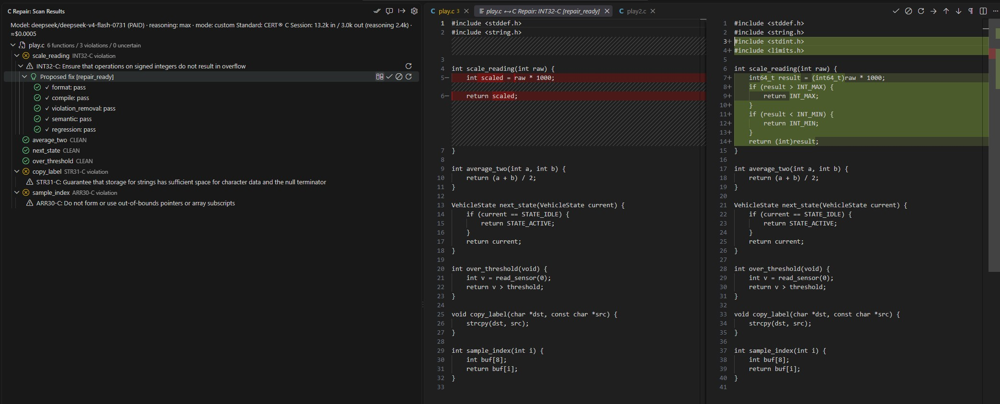

# C Repair

**AI-assisted detection, repair, and validation for C coding standards, in VS Code.** Currently supports CERT® C; MISRA C support is planned.

C Repair scans a single C file for CERT® C violations, generates repair candidates with an LLM-driven repair harness, runs validation gates (compile / violation-removal / semantic / regression), and lets you review each fix as a diff before accepting it into your file. The final authority is always you: nothing is applied without an explicit Accept.

## Quick start (3 steps)

Install the `.vsix` (`Extensions: Install from VSIX…` — this build is distributed locally; the **Get started with C Repair** walkthrough opens on first activation), then:

1. **Key** — `C Repair: Connect OpenRouter`: approve in the browser, paste the one-time code into the VS Code prompt (works locally, under WSL, and on remotes). Or paste an existing key with `C Repair: Set API Key`.
2. **Bridge** — `C Repair: Set Up Bridge` (one-time; provisions a private Python env from the bundled wheels, then verifies `/health`).
3. **Scan** — open a `.c` file and run `C Repair: Scan Current File` (or `Scan & Fix Current File` to also generate repairs and enter the review queue).

## How it works

- A small local bridge (FastAPI, spawned by the extension) wraps the repair harness; the extension talks to it over localhost with a per-session token.
- `Accepted file = your original file + the hunks you accepted` — inferred context (prelude) never leaks into your source.
- Validation results are shown per gate; failing "judgment" gates (violation-removal / semantic / regression) can be overridden explicitly, mechanical gates (compile) cannot.
- `Export Repair Report` produces a review-evidence Markdown (dispositions, gate evidence, accepted diffs) for PRs and QA.

## Costs (BYOK)

Scans and repairs call an LLM through **your** OpenRouter key. A single-file scan typically costs a few cents; each repair with validation gates costs a few cents more (large files cost more). The status bar shows the session's token usage and an approximate cost after each run. The **free** model mode (`C Repair: Choose Model Mode`) costs $0 with reduced quality and shared-pool rate limits — good for trying the flow.

## Data handling

The content of the scanned C file (and the inferred context declarations) is sent to OpenRouter and routed to the configured model provider (preset: DeepSeek via DeepInfra) to perform detection, repair, and validation. **Do not scan files you are not allowed to share with those services.** Everything else stays local: the bridge runs on 127.0.0.1 only, nothing is stored outside your machine, and your API key lives in VS Code's secret storage (never in settings, logs, or command lines).

## Requirements

- VS Code 1.85+.
- `gcc` on PATH (used locally for the compile gate; optional — without it the compile check reports as skipped).
- A Python environment for the local bridge, any ONE of:
  - [`uv`](https://docs.astral.sh/uv/getting-started/installation/) — `Set Up Bridge` provisions everything automatically (installs uv with your consent when missing);
  - the monorepo dev venv (`services/repair-api/.venv`) when developing in the repo — detected automatically, takes priority;
  - a manually prepared Python 3.10+ env with `repair-api` installed, pointed to by `crepair.bridge.pythonPath`.
- An [OpenRouter](https://openrouter.ai) API key (bring your own key).

## Known limitations

- **Single `.c` file at a time** — no project-wide analysis.
- **One finding per function** is repaired (harness constraint).
- **Header-dense files are best-effort**: external declarations are inferred and shown for review; when the context still does not fully compile, results are marked **context incomplete (N symbols still missing)** — detection may miss violations there, and zero findings is not a safety guarantee.
- MISRA C is out of scope.

### Repairs requiring project-wide changes

A candidate fixes a single function, so some repairs are only a **starting point**: a fix may change the function's public API (callers must be updated) or depend on facts outside the file (e.g. STR31-C needs the destination buffer's capacity, which often lives in the caller). Passing the validation gates does not guarantee your whole project is correct. Accept such a fix as a base, complete the wider changes yourself, then re-scan to verify — the **Getting Started** walkthrough (*Generate repairs and review* → *When a repair needs wider changes*) walks through this.

## Troubleshooting the bridge setup

| Symptom | Meaning / fix |
| --- | --- |
| "uv is required … was not installed" | You declined the installer. Install uv manually (link in the message), then re-run `Set Up Bridge`. |
| "The uv installer failed — a network problem…" | Check connectivity / proxy and retry. |
| "…failed — the disk appears to be full" | Free disk space and retry. |
| "No bridge wheels were found…" | This extension build lacks `bridge-dist/` (packaging issue). Monorepo developers use the repo venv instead — no bootstrap needed. |
| "…does not match its recorded checksum" | The bundle is damaged: reinstall the vsix. |
| "uv was installed but could not be located" | Restart VS Code so PATH refreshes, or install uv manually. |
| Bridge starts but the model is empty in `/health` | Broken install — reinstall the vsix and re-run `Set Up Bridge` (the bridge logs a config error in the "C Repair" Output channel). |

## Commands

| Command | Purpose |
| --- | --- |
| `C Repair: Set Up Bridge` | Provision the local bridge environment (one-time). |
| `C Repair: Scan Current File` | Detect CERT C violations. |
| `C Repair: Scan & Fix Current File` | Scan, auto-generate repairs, review queue. |
| `C Repair: Accept All Reviewed` | Apply every reviewed, eligible candidate. |
| `C Repair: Export Repair Report` | Review-evidence Markdown for the current session. |
| `C Repair: Connect OpenRouter` | Mint a key: approve in the browser, paste the code. |
| `C Repair: Choose Model Mode` | Switch between the preset and free models. |
| `C Repair: Reset Extension State` | Clear key + one-time flags; re-run onboarding. |

## Attribution

CERT® is a registered trademark of Carnegie Mellon University. This project is not affiliated with, sponsored, or endorsed by CMU or the Software Engineering Institute. Rule identifiers and titles are referenced for interoperability; this tool does not provide official conformance certification.
