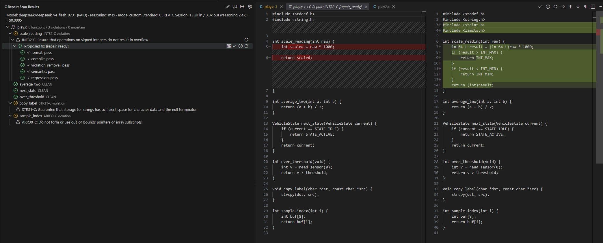

# C Repair

**AI-assisted detection, repair, and validation for C coding standards, in VS Code.** Currently supports CERT® C.

Scan a C file, review each proposed repair as a diff, and apply the changes you choose. Each candidate includes five validation checks. **Nothing is applied without an explicit Accept.**

## Get started

Install **C Repair** from the [Visual Studio Marketplace](https://marketplace.visualstudio.com/items?itemName=safe-c-ai.c-repair), then open the C Repair view from the Activity Bar.

Version **0.2.0** supports local and API inference on **Apple Silicon Mac (ARM64)**, **Windows x64**, and **Linux / WSL2 x64**. Other hosts are not supported in 0.2.0. For manual installation, choose the VSIX matching the extension host. With VS Code Remote / WSL, inference runs on the remote host.

### Use a local model

1. Choose **Use a local model** in the C Repair view and select a model. Initial quantization and memory settings are automatic.
2. Check the download size and location, then choose **Download and start**. The extension prepares the model, runtime and bridge; no API key is needed.
3. Open a `.c` file, right-click in the editor, and choose **Scan Current File** or **Scan & Fix Current File**.

Normal Mac downloads use MLX; Windows / Linux downloads use GGUF. Your own models can be used through Custom. Adjust reasoning, tokens or the model from **C Repair's gear → Setup → Local Setup → Local model settings**, then choose **✓ Apply changes**.

### Use the OpenRouter API

1. Choose **Connect OpenRouter** in the C Repair view. Approve in the browser and paste the one-time code into VS Code. For an existing key, use **gear → Setup → Api Key → Set API Key manually**. Choose an API model mode when prompted.
2. Run **gear → Setup → Commands → Set Up Bridge** once and wait for the ready message.
3. Open a `.c` file, right-click, and choose **Scan Current File** or **Scan & Fix Current File**.

**Preset** uses this release's model/provider configuration; **Free** uses a shared free pool; **Custom** uses your model/provider settings. All API modes require an OpenRouter key. To switch from Local to API, also select Preset, Free or Custom under **gear → Models & Routing → Model Mode**.

## Quick start with a practice file

After setup, learn the workflow on a small sample before using your own code.

1. Choose **Open practice sample** in the C Repair view, its **…** menu, or **gear → Setup → Commands**. A fresh, writable `quick-start.c` opens beside the guide; your project files are untouched.
2. Right-click inside the sample → **Scan & Fix Current File**. If Context Review opens, check the declarations and choose **Confirm & Scan**.
3. Read the proposed diff and validation results, then choose **Accept Repair (✓)** or **Reject Repair (⊘)**. Accept edits only your practice copy; save it with Ctrl+S (⌘S on Mac).
4. Return to the sample's editor tab and run **Scan Current File** again to inspect the changed code.

The sample has an unchecked array index. Detection and repair use your selected model, so results vary. API use sends the sample to OpenRouter and consumes tokens. Open **Quick start & user guide** from the view's **book icon** for the full steps: [English](docs/user-guide.md#c-repair-quick-start) / [日本語](docs/user-guide.ja.md#c-repair-クイックスタート).

## Updating from an earlier version

After installing 0.2.0, reload VS Code. If you previously set up the Python bridge, run **gear → Setup → Commands → Set Up Bridge** once to install the updated bridge before using Scan or local setup. Your C Repair settings and API key are retained. If `crepair.bridge.pythonPath` points to your own Python environment, [update its bridge wheels separately](docs/local-models.md#custom-python-bridge).

See the [change log](CHANGELOG.md) for this release.

## Guides

- **Using C Repair:** [English](docs/user-guide.md) / [日本語](docs/user-guide.ja.md) — setup, Scan, Context Review, validation, Accept / Reject, and reports.
- **Local model settings:** [English](docs/local-models.md) / [日本語](docs/local-models.ja.md) — model requirements, memory, reasoning, tokens and troubleshooting.
- **[C Repair Leaderboard](https://safe-c-ai.github.io/c-repair-leaderboard/cert-c/)** — model evaluation results.

**Quick start & user guide** in C Repair settings or the view's book icon opens the bundled guide. **Settings guide** in Local model settings opens local tuning instructions. Japanese VS Code display languages open Japanese; other languages open English. The bundled guides can be read without internet access.

## Review every change

**Scan Current File** detects violations. **Scan & Fix Current File** also generates candidates and opens the review queue. Check the original and proposed code, read the validation evidence, and choose **Accept**, **Reject**, **Regenerate**, or **Next**.

A format or compile failure blocks Accept. Warnings from violation-removal, semantic or regression checks can be overridden only with an explicit confirmation. A skipped check has not established correctness. **Export Repair Report** saves findings, evidence and decisions as Markdown, including code diffs where applicable.

Accepted patches modify your original file; inferred helper declarations are never written into it. Some repairs need caller updates or other project changes. Complete those changes and run your normal build, tests and another scan.

## Requirements

- VS Code 1.85 or later.
- Internet access for API inference, or for initial local model/runtime downloads.
- A Python bridge environment, prepared with **Set Up Bridge** for API inference or automatically during local setup. The extension can install `uv` as part of that preparation.
- `gcc` on PATH for compile validation (Apple Clang exposed as `gcc` is supported on Mac). Without an available compiler, the compile check is skipped.
- For local inference: sufficient memory and a compatible engine. See the [local settings guide](docs/local-models.md#first-setup) for OS requirements and automatic profiles. Mac MLX execution has been checked on an M1 Max with 64 GiB; the 16/18 GB Mac profiles are experimental. Other Mac memory profiles are automatic starting settings, not guarantees of measured speed or quality on every device.

## Costs and data handling

**API:** code and inferred helper declarations are sent to OpenRouter and the selected model provider for detection, repair and LLM validation. Your OpenRouter key stays in VS Code's secret storage. Paid usage depends on model pricing and token consumption; Free is subject to shared-pool availability and rate limits. Session token usage and approximate API cost are shown when available.

**Local:** detection, repair and LLM validation run on the extension host without an API key. Models and runtimes are downloaded from external hosts during setup; inference does not send your code to OpenRouter. Model storage and memory use are described in the local settings guide.

Reports can contain your code. Review their contents before sharing them.

## Limits

- One `.c` file at a time; no project-wide analysis.
- One finding per function is handled by the repair harness.
- Missing external declarations may make context incomplete and detection less reliable. Zero findings does not prove the file safe.
- Passing validation does not guarantee project-wide correctness.
- MISRA C is not supported.

## Common actions

| Action | Where to find it |
| --- | --- |
| Scan / Scan & Fix | Right-click in a C editor |
| Local setup and tuning | Gear → Setup → Local Setup |
| API key | Gear → Setup → Api Key |
| API model mode and reasoning | Gear → Models & Routing |
| Set Up Bridge, reports, Quick start and practice sample | Gear → Setup → Commands |
| Stop Local Model | Command Palette: C Repair: Stop Local Model |

If setup fails, open **View → Output → C Repair** for the reported cause. Resolve it and retry setup; for local generation or memory errors, use [local troubleshooting](docs/local-models.md#troubleshooting).

## Attribution

CERT® is a registered trademark of Carnegie Mellon University. This project is not affiliated with, sponsored, or endorsed by CMU or the Software Engineering Institute. Rule identifiers and titles are referenced for interoperability; this tool does not provide official conformance certification.
